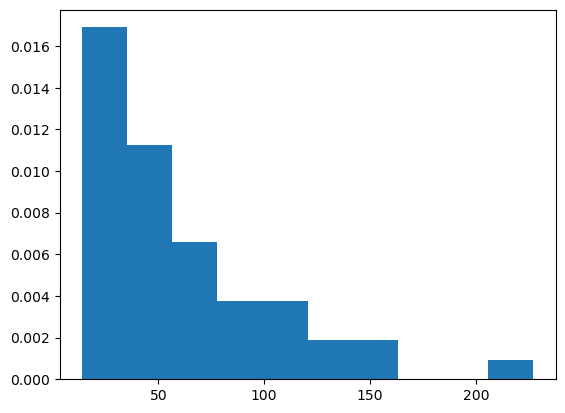
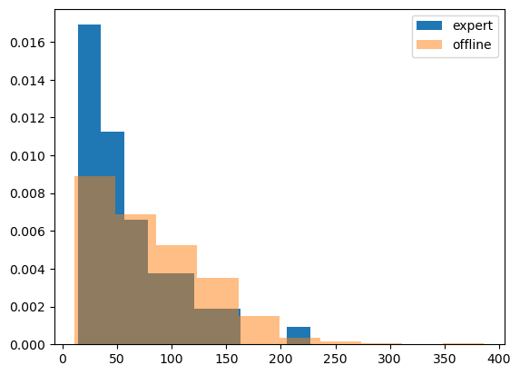
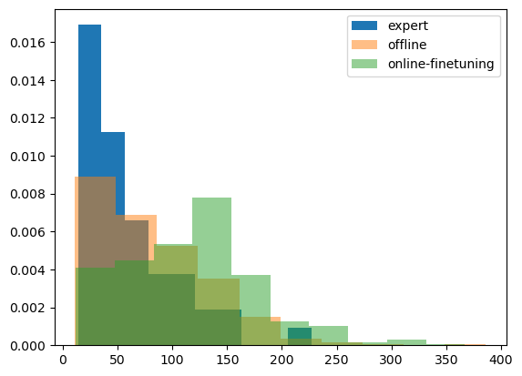
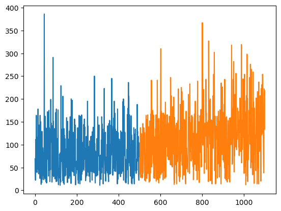

# A PyTorch implementation of Wasserstein distance Actor-Critic (WAC)

## Requirements

- Pytorch
- gym
- matplotlib

## Examples
You can find the running example of `WAC` on `gym` `cartpole-v2` environment from `AWAC-example.ipynb`.

## Experiment Results

It is confirmed that `AWAC` can learn better policy than its behavior policy in offline mode.

### Offline dataset preparation
- Prepare the offline dataset by using a good enough DQN (well trained but with a 40% chance act randomly)
- 50 independent `cartpole-v2` trial were made.

- The values on the x-axis show how long each episode was. (Longer is better)
- The values on the y-axis indicate the frequency of the episode lengths.

### Offline training

- After training 8000 gradient steps with 1024 sized mini-batch, `AWAC` was able to learn
  a policy better than the one of `good enough DQN`.

- The blue distribution shows the performance distribution of the `good enough DQN`.
- The orange distribution shows the performance distribution of the offline trained `AWAC`.

### Online finetuning

- After `AWAC` trained on 600 episode amount of online training,
  `AWAC` shows even better control performance. (offline trained `AWAC` + 600 ep online training)

- Moreover, the `AWAC` didn't show the 'dip', a phenomenon that indicates sudden performance drop right after online training

- The blue curve shows the performance of **offline** dataset only
- The orange curve shows the performance trained in **online** mode. i.e.,
  the samples from replay memory would contain some amount of distributional shift.

### video

